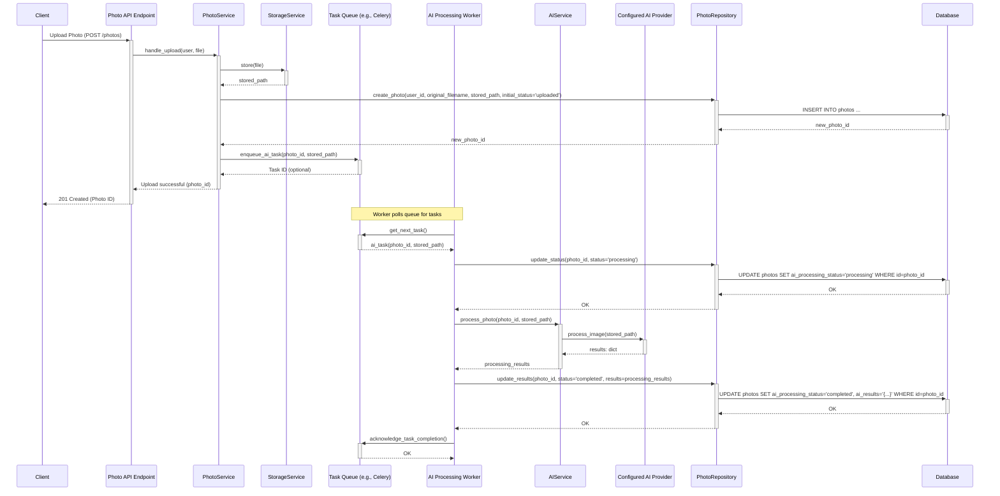

# AI Image Processing Architecture

This document outlines the architecture for integrating AI image processing capabilities into the existing system, building upon the Photo Upload feature.

## 1. Goals

*   Integrate AI processing for uploaded photos.
*   Maintain modularity and separation of concerns.
*   Support asynchronous processing for potentially long-running AI tasks.
*   Allow easy extension with different AI providers (local and cloud-based).
*   Track the status and results of AI processing.

## 2. Proposed Architecture

We will introduce a new `AIService` and leverage a task queue for asynchronous processing.

### 2.1. Components

*   **Photo Service (`backend/services/photo/photo_service.py`)**:
    *   Orchestrates the photo upload process.
    *   After successfully saving the photo metadata and storing the image file via the `StorageService`, it enqueues an AI processing task.
    *   It **does not** directly call the `AIService`.
*   **Storage Service (`backend/services/storage/`)**:
    *   Remains unchanged. Provides methods to store and retrieve photo files.
*   **AI Service (`backend/services/ai_processing/`)**: (New)
    *   Responsible for interacting with different AI providers.
    *   Contains the logic to fetch the image file (using `StorageService`), send it to the configured AI provider, and handle the results.
    *   Uses a factory pattern to instantiate the appropriate AI provider based on configuration.
*   **AI Provider Interface (`backend/services/ai_processing/base.py`)**: (New)
    *   Defines the contract for all AI providers (e.g., `process_image(image_path: str) -> dict`).
*   **AI Provider Implementations (`backend/services/ai_processing/providers/`)**: (New Directory)
    *   Concrete implementations for specific AI services (e.g., `local_dummy_provider.py`, `aws_rekognition_provider.py`, `google_vision_provider.py`).
*   **Task Queue (e.g., Celery + Redis/RabbitMQ)**:
    *   Manages asynchronous tasks.
    *   A dedicated worker process will pick up AI processing tasks.
*   **AI Processing Task Worker**:
    *   Consumes tasks from the queue.
    *   Instantiates the `AIService`.
    *   Calls the `AIService` to process the image.
    *   Updates the `Photo` model in the database with the status and results via the `PhotoRepository`.
*   **Photo Model (`backend/models/photo.py`)**:
    *   Needs schema updates to track AI processing.
*   **Photo Repository (`backend/repositories/photo_repository.py`)**:
    *   Needs methods to update AI processing status and results for a given photo.

### 2.2. Data Flow (Async Processing)



### 2.3. Service Interactions

```mermaid
graph TD
    subgraph "Backend Application"
        PAPI["Photo API (/photos)"] --> PS[PhotoService]
        PS --> STO[StorageService]
        PS --> TQ[Task Queue]
        PS --> PR[PhotoRepository]

        subgraph "Async Worker Process"
            AIW[AI Worker] --> TQ
            AIW --> AIS[AIService]
            AIW --> PR
        end

        subgraph "AI Processing Module"
            AIS --> AIFac[AI Provider Factory]
            AIS --> STO
            AIFac --> ProvBase(AIProvider Base)
            AIFac --> Prov1[Provider 1 Impl]
            AIFac --> Prov2[Provider 2 Impl]
            AIFac --> ProvN[Provider N Impl]
            ProvBase <|.. Prov1
            ProvBase <|.. Prov2
            ProvBase <|.. ProvN
        end

        PR --> DB[(Database)]
    end

    Client --> PAPI
    TQ -.-> AIW # Task Consumption

    style Client fill:#f9f,stroke:#333,stroke-width:2px
    style TQ fill:#ccf,stroke:#333,stroke-width:2px
    style AIW fill:#ccf,stroke:#333,stroke-width:2px
```

### 2.4. AI Provider Extensibility

*   The `AIService` will use a factory (`backend/services/ai_processing/factory.py`) to get an instance of an `AIProvider` based on configuration (e.g., environment variables).
*   All providers must inherit from `backend/services/ai_processing/base.py::AIProviderBase` and implement the required methods (e.g., `process_image`).
*   Configuration (e.g., `AI_PROVIDER_TYPE=local`, `AI_PROVIDER_TYPE=aws_rekognition`) will determine which provider is used.
*   Provider-specific configurations (API keys, endpoints) will also be managed via environment variables or a secure configuration system (e.g., HashiCorp Vault), **never hardcoded**.

### 2.5. Schema Updates (`backend/models/photo.py`)

The `Photo` model needs additions:

```python
# backend/models/photo.py (Illustrative Additions)
import enum
from sqlalchemy import Column, String, JSON, Enum as SQLEnum
from sqlalchemy.dialects.postgresql import JSONB # Use JSONB for Postgres for better indexing/querying
# ... other imports

class AIProcessingStatus(enum.Enum):
    PENDING = "pending"
    PROCESSING = "processing"
    COMPLETED = "completed"
    FAILED = "failed"

class Photo(Base):
    # ... existing columns: id, user_id, original_filename, stored_path, created_at, updated_at ...

    ai_processing_status = Column(
        SQLEnum(AIProcessingStatus, name="ai_processing_status_enum", create_type=False),
        nullable=False,
        default=AIProcessingStatus.PENDING,
        index=True
    )
    ai_results = Column(JSONB, nullable=True) # Or JSON if not using Postgres
    ai_error_message = Column(String, nullable=True) # To store error details if status is FAILED
    ai_provider_used = Column(String, nullable=True) # Record which provider processed it
```

*   **Requires a new Alembic migration** to apply these changes to the database.
*   The `PhotoRepository` needs corresponding `update_ai_status` and `update_ai_results` methods.

## 3. Considerations

*   **Task Queue Setup**: Requires setting up Celery (or similar), a message broker (Redis/RabbitMQ), and running worker processes. This adds infrastructure complexity but is crucial for scalability and responsiveness.
*   **Error Handling**: The AI Worker must handle exceptions during processing (network issues, provider errors, invalid images). It should update the photo status to `FAILED` and log relevant details, potentially including `ai_error_message`. Implement retry logic within the task queue for transient errors.
*   **Security**: API keys and credentials for cloud AI providers must be securely managed (e.g., environment variables, secrets manager) and **not** committed to the repository.
*   **Cost**: Cloud AI services incur costs. Monitor usage and implement controls if necessary.
*   **Result Schema**: The structure of `ai_results` (JSONB) will depend on the specific data returned by the AI providers. It should be flexible enough to accommodate different types of results (tags, descriptions, object detection coordinates, etc.). Define a clear schema or validation process if consistency is required.
*   **Local Development**: Provide a simple "dummy" or "local" AI provider implementation for easier local development and testing without needing cloud credentials or incurring costs.

## 4. Next Steps

1.  Create the new service structure: `backend/services/ai_processing/`, `backend/services/ai_processing/providers/`.
2.  Implement the `AIProviderBase` interface and the factory.
3.  Implement at least one concrete provider (e.g., a dummy provider).
4.  Update the `Photo` model and create an Alembic migration.
5.  Update the `PhotoRepository` with methods to modify AI status/results.
6.  Set up the chosen task queue (e.g., Celery) and broker (e.g., Redis).
7.  Implement the AI processing task logic within a Celery task function.
8.  Modify `PhotoService` to enqueue the task after successful upload.
9.  Add configuration options (environment variables) for selecting the AI provider and its credentials.
10. Write tests for the new service, providers, and task logic.