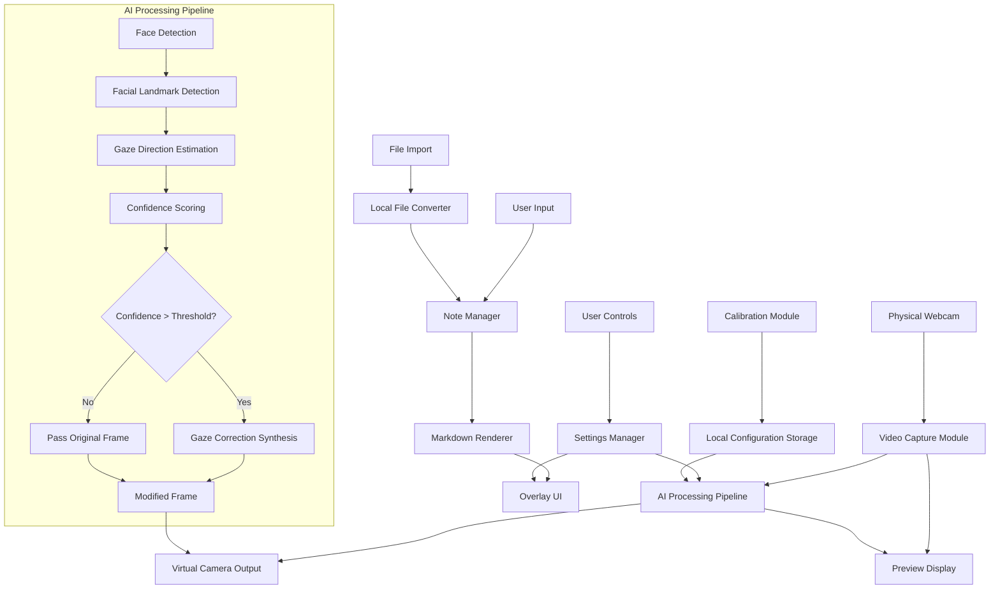

# GazeShift System Architecture

## Architecture Overview

GazeShift is designed as a desktop application with all processing occurring locally on the user's device. This document outlines the system architecture, component relationships, and data flow.

## System Components

## Component Descriptions

### Core Video Pipeline

1. **Video Capture Module**
   - Interfaces with physical webcam hardware
   - Captures raw video frames at target framerate
   - Implements error handling for camera access issues

2. **AI Processing Pipeline**
   - **Face Detection**: Locates the user's face in each frame
   - **Facial Landmark Detection**: Identifies key facial points, particularly around the eyes
   - **Gaze Direction Estimation**: Calculates current gaze vector
   - **Confidence Scoring**: Determines confidence level in detection and potential correction quality
   - **Decision Gate**: Evaluates if confidence meets threshold for correction
   - **Gaze Correction Synthesis**: Modifies eye regions to simulate eye contact with camera

3. **Virtual Camera Output**
   - Registers as a system virtual camera
   - Outputs processed frames to be used by video conferencing applications
   - Handles device registration and frame formatting

### Note Management System

1. **Note Manager**
   - Handles user text input
   - Manages note content and formatting
   - Coordinates with file converter for imports

2. **Local File Converter**
   - Performs conversion of .doc/.docx files to Markdown
   - Runs asynchronously to maintain UI responsiveness
   - All conversion happens locally (no cloud services)

3. **Markdown Renderer**
   - Renders formatted notes in the overlay
   - Supports full Markdown syntax
   - Handles teleprompter scrolling functionality

### User Interface Components

1. **Overlay UI**
   - Semi-transparent, repositionable notes display
   - Implements screen capture resistance techniques
   - Manages opacity and size adjustments

2. **User Controls**
   - Provides toggle for AI correction
   - Controls for overlay appearance and positioning
   - Teleprompter controls

3. **Preview Display**
   - Shows side-by-side or toggle view of original and processed video
   - Provides visual feedback on AI correction status

### Configuration & Support Systems

1. **Settings Manager**
   - Stores and applies user preferences
   - Manages application state
   - Controls AI processing parameters

2. **Calibration Module**
   - Guides user through initial setup
   - Collects reference data for optimizing gaze correction
   - Stores calibration data locally

3. **Local Configuration Storage**
   - Securely stores settings and calibration data
   - Maintains user preferences between sessions

## Data Flow

1. **Video Processing Flow**:
   - Webcam captures frame → AI processing pipeline analyzes frame → If confidence threshold met, eye region modified → Frame sent to virtual camera output

2. **Note Management Flow**:
   - User inputs text or imports file → Local conversion if needed → Content rendered with Markdown → Displayed in overlay UI

3. **Configuration Flow**:
   - User adjusts settings → Settings manager updates parameters → Changes applied to relevant components

## Security & Privacy Considerations

- All video processing happens locally on the user's device
- No video frames or unencrypted notes leave the system
- Configuration and calibration data stored securely in standard application locations
- No cloud services or external processing

## Performance Considerations

- AI processing optimized for <100ms latency
- Asynchronous operations for heavy tasks (file conversion, AI processing)
- Optional GPU acceleration for AI pipeline
- Resource usage monitored and optimized

## Dependencies

- Physical webcam hardware
- OS-level virtual camera support
- Local processing libraries (MediaPipe, OpenCV, ONNX Runtime, etc.)
- Local file conversion capabilities
- GPU acceleration (optional) 