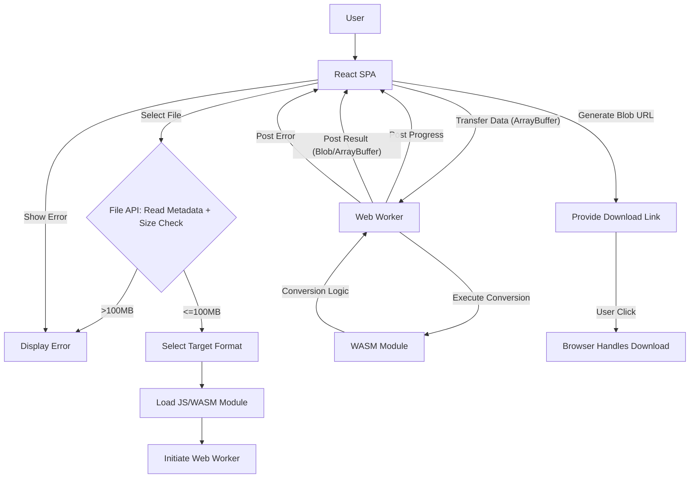
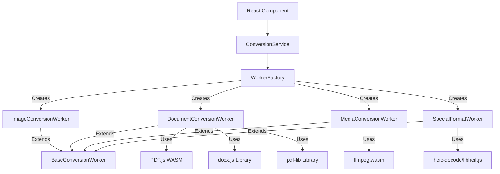

# Architecture: Local File Converter v1.0

## Core Principles

- **Client-Side Single Page Application (SPA):** All UI, file handling, and conversion logic executes in the user's browser.
- **No Conversion Backend:** The web server only serves static assets (HTML, CSS, JS, WASM). It MUST NOT handle file uploads for conversion.
- **Modular Conversion Engines:** Each conversion type (or related group) is encapsulated in a distinct module (JS + WASM).
- **Lazy Loading:** Modules SHOULD be loaded on demand to minimize initial load time.
- **Web Workers:** Intensive conversion tasks MUST run in Web Workers to keep the UI responsive.

## High-Level Flow

## Components

### 1. React SPA (Main Thread)

- Handles UI rendering and user interactions.
- Manages file selection and initial validation (size, extension).
- Orchestrates module loading.
- Communicates with Web Workers (sending data, receiving progress/results/errors).
- Generates download links using Blob URLs.
- Displays progress and error messages.

### 2. Worker Architecture

#### 2.1 Base Conversion Worker
- Abstract class that defines the standard interface for all workers
- Provides common functionality:
  - Message handling infrastructure
  - Progress reporting
  - Error handling and reporting
  - Standardized lifecycle management

#### 2.2 Specialized Workers
- Implement type-specific conversion logic:
  - **ImageConversionWorker:** Handles image format conversions (JPG ↔ PNG)
  - **DocumentConversionWorker:** Handles document conversions (PDF ↔ DOCX, JPG/PNG → PDF, PDF → JPG)
  - **MediaConversionWorker:** Handles audio/video conversions (MP4 → MP3, MOV → MP4, MP4 → GIF)
  - **SpecialFormatWorker:** Handles special formats (HEIC → JPG)

#### 2.3 Worker Factory
- Manages worker creation and reuse
- Maps file formats to appropriate worker types
- Provides centralized worker management (creation, termination)
- Exposes supported conversion formats to the UI

#### 2.4 Conversion Service
- Main interface between UI and workers
- Orchestrates the conversion process
- Handles worker communication
- Provides progress updates to UI components
- Manages conversion results and errors

### 3. WebAssembly Implementation

#### 3.1 WASM Module Organization
- Modular WASM implementation aligned with worker types:
  - Document conversion modules (PDF.js, docx.js, pdf-lib)
  - Media conversion modules (ffmpeg.wasm)
  - Special format modules (heic-decode/libheif.js)

#### 3.2 WASM Integration
- Integration pattern for each worker type:
  - Workers load and initialize appropriate WASM modules
  - Workers manage data transfer between JS and WASM context
  - Workers translate between worker message protocol and WASM API

## Detailed Functionality Notes

### File Input
- Drag-and-drop and `<input type="file">`. Rely on file extension for MVP.
- File metadata extraction and size validation (reject files >100MB).

### Format Selection
- Dynamically populate based on input extension and MVP list.
- UI adapts to show only valid target formats for the selected input file.

### Worker Communication
- Use `postMessage` and transferable objects (like `ArrayBuffer`) for efficiency.
- Standardized message protocol:
  - `START_CONVERSION`: Initiates conversion with file data and target format
  - `PROGRESS_UPDATE`: Reports conversion progress (0-100%)
  - `CONVERSION_COMPLETE`: Returns converted file as Blob with metadata
  - `CONVERSION_ERROR`: Reports errors with detailed information

### WASM Execution
- Workers interact with WASM modules to perform conversions.
- WASM modules handle the core data transformation.
- Progress is reported from WASM to Worker to UI when possible.

### Progress Indication
- Display percentage if possible, otherwise indeterminate spinner.
- Avoid inaccurate time estimates.
- Show additional context (e.g., "Processing page 2/5") when available.

### Output & Download
- Convert result to `Blob` with correct MIME type.
- Generate object URL (`URL.createObjectURL`).
- Create `<a>` download link with suggested filename.
- Revoke URL (`URL.revokeObjectURL`) after use.

### Error Handling
- Must be robust at all stages, providing user-friendly messages.
- Categorize errors (input validation, conversion, output generation).
- Provide recovery suggestions when possible. 