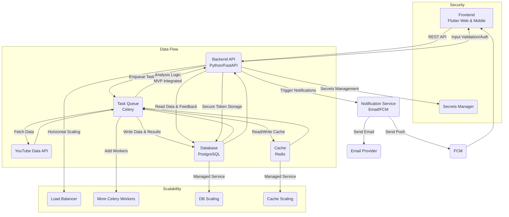

# GuardianLens YouTube-Only MVP: System Architecture

## Overview

This document describes the system architecture for the GuardianLens YouTube-Only MVP based on the requirements outlined in the PRD, Tech Spec, and supplementary documentation. The architecture follows a microservices-oriented approach while maintaining simplicity for the MVP launch.

## Core Components

### 1. Frontend (Flutter Web & Mobile)

- **Technology**: Flutter + Dart (State Management: Bloc/Riverpod, Routing: GoRouter)
- **Responsibility**: 
  - Provides user interface for parents to register, log in, manage child profiles
  - Facilitates YouTube account linking via Google OAuth
  - Displays the dashboard of subscribed channels with risk flagging
  - Enables parent feedback on flagged channels ("Mark as Not Harmful")
- **Security Features**:
  - Secure local storage of parent JWTs and account tokens using `flutter_secure_storage`
  - HTTPS communication with Backend API
- **Notification Handling**:
  - Receives push notifications via Firebase Cloud Messaging (FCM)

### 2. Backend API (Python/FastAPI)

- **Technology**: Python + FastAPI
- **Responsibility**:
  - Serves as the central hub for all frontend requests
  - Handles parent authentication (JWT)
  - Manages ParentUser and ChildProfile data
  - Initiates YouTube account linking (Google OAuth)
  - Securely stores child account OAuth tokens
  - Provides dashboard data endpoints
  - Processes parent feedback
  - Triggers background tasks
- **Security Features**:
  - JWT authentication
  - Role-Based Access Control (RBAC)
  - Input validation and sanitization
  - Rate limiting
  - Encrypted storage of sensitive data

### 3. Task Queue (Celery + Redis/RabbitMQ)

- **Technology**: Celery with Redis or RabbitMQ as message broker
- **Responsibility**:
  - Handles asynchronous and scheduled tasks
  - Manages daily YouTube data fetching and analysis jobs
  - Decouples the API from long-running processes
- **Scalability Features**:
  - Horizontally scalable by adding workers
  - Configurable concurrency settings

### 4. YouTube Data Fetcher (Part of Backend/Celery Workers)

- **Technology**: Python within Celery workers
- **Responsibility**:
  - Uses stored OAuth tokens to fetch data from YouTube API
  - Makes efficient API calls (`subscriptions.list`, `channels.list`, `playlistItems.list`, `videos.list`)
  - Implements aggressive caching to minimize API calls
  - Handles YouTube API errors, rate limits, and quota issues
  - Stores fetched metadata in the database
- **Critical Dependency Handling**:
  - Implements sophisticated caching for API quota management
  - Monitors quota usage
  - Provides graceful degradation when quota limits are reached

### 5. Analysis Engine (Integrated within Backend/Celery Workers for MVP)

- **Technology**: Python (potentially with spaCy/NLTK for text processing)
- **Responsibility**:
  - Analyzes text metadata using keyword/pattern matching
  - Assigns risk flags/categories based on matches
  - Stores analysis results in the database
- **Design for Future**:
  - Modular implementation to allow extraction into a separate microservice
  - Structured to enable integration of more advanced techniques (LLMs) post-MVP

### 6. Database (PostgreSQL)

- **Technology**: PostgreSQL (managed service like AWS RDS or Google Cloud SQL)
- **Responsibility**:
  - Persistent storage for all system entities:
    - ParentUser
    - ChildProfile
    - LinkedAccount (Platform=YouTube)
    - SubscribedChannel
    - AnalyzedVideo
    - AnalysisResult
    - Alert
    - AuditLog
  - Stores encrypted OAuth tokens
- **Security Features**:
  - Encryption at rest
  - Network isolation/VPC
  - Strong access controls

### 7. Cache (Redis)

- **Technology**: Redis (managed service like AWS ElastiCache or Google Memorystore)
- **Responsibility**:
  - Aggressive caching of YouTube API responses
  - Stores channel and video metadata with appropriate TTLs (24 hours)
  - Can serve as message broker for Celery
- **Quota Management**:
  - Critical component for YouTube API quota mitigation
  - Configurable TTLs for different types of data

### 8. Notification Service (Email Provider + FCM)

- **Technology**: Email Provider API (AWS SES, SendGrid) + Firebase Cloud Messaging
- **Responsibility**:
  - Sends email notifications (daily scan summary)
  - Sends mobile push notifications
  - Triggered by Backend/Celery workers

## Service Boundaries and Data Flow

### Primary Data Flows

1. **Frontend ↔ Backend API**
   - RESTful communication using HTTPS
   - JWT authentication for parent users
   - API endpoints for all user actions and data retrieval

2. **Backend API → Task Queue**
   - Backend enqueues tasks for asynchronous processing
   - Examples: `start_youtube_scan`, `analyze_channel_metadata`

3. **Task Queue Workers → YouTube Data API**
   - Workers use stored OAuth tokens to fetch data
   - Makes calls with appropriate scopes and parameters
   - Implements backoff strategies for rate limiting

4. **Task Queue Workers ↔ Cache**
   - Read cached data before making API calls
   - Write API responses to cache with appropriate TTLs
   - Optimizes for quota usage

5. **Task Queue Workers → Database**
   - Store fetched metadata and analysis results
   - Update scan status information

6. **Backend API ↔ Database**
   - Read data for dashboard display
   - Write user/profile data and store feedback
   - Maintain audit logs

7. **Backend/Task Queue Workers → Notification Service**
   - Trigger email notifications for scan completion
   - Send push notifications for high-priority findings

8. **Notification Service → Frontend**
   - Mobile frontend receives push notifications via FCM

## Scalability Considerations

1. **Stateless Backend API**
   - Designed to be horizontally scalable
   - No session state stored on servers

2. **Task Queue**
   - Celery allows adding more workers to handle increased processing load
   - Workers can be distributed across multiple servers/containers

3. **Database & Cache**
   - Using managed services provides built-in scalability options
   - Potential for read replicas as user base grows

4. **Containerization & Orchestration**
   - Docker containers for backend services and workers
   - Kubernetes or PaaS for orchestration
   - Facilitates scaling based on demand

5. **API Quota Management**
   - Critical for effective scaling within YouTube's limitations
   - Aggressive caching and efficient API calls
   - Prioritization of critical vs. non-critical data refresh

## Security Considerations

1. **Secure Token Storage**
   - OAuth tokens and JWTs encrypted at rest
   - `flutter_secure_storage` for mobile
   - Cloud secrets manager for backend
   - Secure token refresh mechanisms

2. **Authentication & Authorization**
   - JWT for parent authentication
   - OAuth 2.0 for YouTube account linking
   - RBAC for resource access control

3. **Input Validation & Sanitization**
   - All user input and API responses validated and sanitized
   - Prevention of injection attacks

4. **API Security**
   - Rate limiting to prevent abuse
   - HTTPS for all communications
   - Secure API key management

5. **Secrets Management**
   - Environment variables or dedicated secrets manager
   - No hardcoded secrets or credentials
   - Rotation policies for sensitive credentials

6. **Compliance**
   - COPPA Verifiable Parental Consent for children under 13
   - GDPR principles (minimization, purpose limitation, etc.)
   - YouTube/Google data policies implemented in consent flows
   - Data retention and deletion policies

7. **Auditing**
   - Comprehensive audit logging for sensitive operations
   - Regular security reviews and testing

## Modularity

1. **Component Separation**
   - Clear boundaries between Frontend, Backend API, Task Queue, etc.
   - Well-defined interfaces between components

2. **Analysis Engine**
   - Integrated within the backend for MVP
   - Designed as a distinct module for future extraction
   - Structured to allow for more advanced analysis techniques post-MVP

3. **Platform Connectors**
   - YouTube-only for MVP
   - Architecture designed to allow future platform additions
   - Data fetching and analysis logic separated from platform-specific details

4. **Frontend Components**
   - Modular Flutter architecture
   - Reusable widgets and screens
   - Separation of UI from business logic

## YouTube API Quota Mitigation

1. **Aggressive Caching**
   - Redis used to cache API responses
   - 24-hour TTL for most data (matching daily scan frequency)
   - Significantly reduces `channels.list` and `videos.list` calls

2. **Efficient API Calls**
   - Request only necessary data parts (`snippet`, `statistics`, `topicDetails`)
   - Limit recent videos to 10 per channel
   - Batch requests where possible

3. **Scheduled Scans**
   - Daily schedule limits overall frequency
   - Staggered execution to spread quota usage

4. **Prioritization**
   - Core subscription data prioritized over supplementary information
   - Critical updates handled before non-critical refreshes

5. **Monitoring**
   - Track quota usage to identify issues early
   - Alerts for approaching limits

6. **Degradation Strategy**
   - Graceful degradation when quota limits approached
   - Preserve critical functionality while limiting non-essential updates

## Architecture Diagram

## Testing Strategy

A comprehensive, multi-layered testing strategy is employed to ensure the reliability, robustness, and security of the GuardianLens application. This includes phased implementation of unit, integration, and end-to-end tests, prioritizing critical paths and high-risk areas.

For a detailed phased plan, including strategy, phases, test types, priority areas, resources, timeline, and coverage criteria, please refer to the [Comprehensive Testing Plan in Development Progress Documentation](../documentation/development-progress.md#comprehensive-testing-plan).

## Future Considerations

1. **Analysis Engine as Microservice**
   - Extract the Analysis Engine into a dedicated microservice
   - Potential integration with LLMs for more nuanced analysis
   - Enable more complex processing without affecting core services

2. **Additional Platform Support**
   - Add connectors for other social media platforms
   - Standardize the data model for cross-platform analysis
   - Maintain platform-specific fetching logic

3. **Real-time Alerting**
   - Enhance notification system for more frequent/immediate alerts
   - WebSocket connections for live dashboard updates

4. **Enhanced Analysis**
   - Image/video content analysis
   - Comment analysis
   - Trend detection across channels

This architecture provides a solid foundation for the GuardianLens YouTube-Only MVP, addressing the key requirements for scalability, security, modularity, and the critical YouTube API quota dependency.